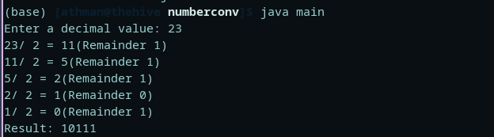

# :1234: Number Converter
> :bulb: **Project** 6
## 💬 Description
> This is a simple java program that converts the decimal number to a binary number
## 🔧 Code Setup
   1. Clone the repo
        ```
            git clone https://github.com/devoure/java-beg.git 

        ```
   1. Move into the project file
        ```bash
            cd numberconv

        ```
   1. Run the code
        ```bash
            javac Main.java
            java Main

        ```
## 💻🏃‍♂️ Running Code Snippet

